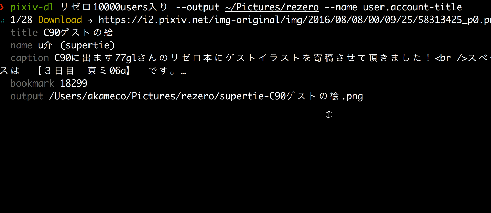

# pixiv-dl [](https://travis-ci.org/akameco/pixiv-dl)

> pixiv downloader




## Install

```
$ npm install --global pixiv-dl
```

## Usage

```
$ pixiv-dl --help


  image downloader for pixiv

  Usage
    $ pixiv-dl [input]

  Options
    --uername, -u   pixiv username (use cache)↲
    --password, -p  pixiv password (use cache)↲
    --output, -o    output directory [Default: curret dir]
    --name, -n      custom filename

  Examples
    $ pixiv-dl リゼロ10000users入り --username hoge --password fuga
    $ pixiv-dl リゼロ10000users入り --output rezero --name user.account-title```

```

## License

MIT © [akameco](http://akameco.github.io)
